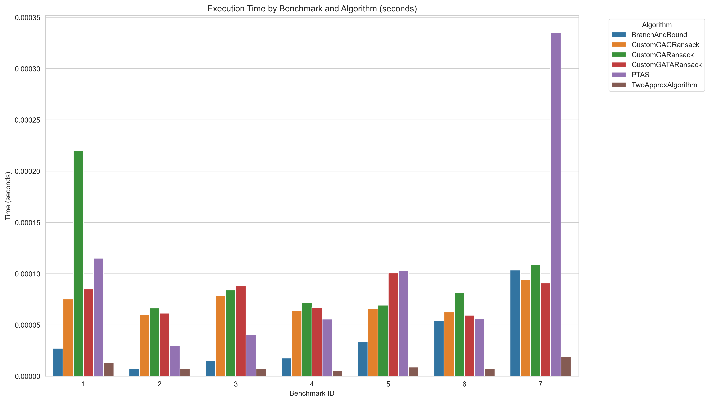

# IO-Lab3-GeneticAlgorithms

Genetic algorithms for solving Knapsack 0-1 problem

# **Отчет: Knapsack 0-1 problem**

Мы реализовали генетический алгоритм для решения knapsack 0-1 problem. Основной алгоритм инициализируется на полностью случайных весах. Два дополнительных: Greed и TwoApprox использует при инициализации соответствующие алгоритмы.

Алгоритм на каждом бенчмарке запускался 1000 раз, чтобы оценить среднее время и среднее качество. Видно, что все алгоритмы работают в общем хуже, чем остальные, что объясняется выбором гиперпараметров таким образом, чтобы увеличить скорость работы за счёт малого числа итерации и размера популяции. Ниже представлена таблица результатов, сгруппирована по бенчмаркам и алгоритмам.
Стартовые параметры:
```
custom_ga_params = {
        'population_size': 3,
        'generations': 2,
        'crossover_rate': 0.85,
        'mutation_rate': 0.1,
        'tournament_size': 3,
        'elitism': True
    }
```

# **Таблица:**

| bench id | algorithm          | time                  | number of inter solutions | alg weights                     | alg total weight | alg profit |
|----------|--------------------|-----------------------|---------------------------|----------------------------------|------------------|------------|
| 1        | BranchAndBound     | 2.7287e-05            | 12                        | [1, 1, 1, 1, 0, 1, 0, 0, 0, 0]   | 165              | 309.0      |
| 1        | CustomGAGRansack   | 7.517899999999998e-05 | 6                         | [1, 1, 1, 1, 0, 1, 0, 0, 0, 0]   | 165              | 309.0      |
| 1        | CustomGARansack    | 0.00022030300000000004 | 6                         | [0, 1, 0, 1, 0, 0, 0, 0, 1, 0]   | 164              | 228.504    |
| 1        | CustomGATARansack  | 8.494199999999996e-05 | 6                         | [1, 1, 1, 1, 0, 1, 0, 0, 0, 0]   | 165              | 309.0      |
| 1        | DPWeights          | 0.0010803129999999994 | 1123                      | [1, 1, 1, 1, 0, 1, 0, 0, 0, 0]   | 165              | 309.0      |
| 1        | PTAS               | 0.00011507399999999996 | 56                        | [1, 1, 1, 1, 0, 1, 0, 0, 0, 0]   | 165              | 309.0      |
| 1        | TwoApproxAlgorithm | 1.3189999999999997e-05 | 6                         | [1, 1, 1, 1, 0, 1, 0, 0, 0, 0]   | 165              | 309.0      |
| 2        | BranchAndBound     | 7.409e-06             | 12                        | [0, 1, 1, 1, 0]                  | 26               | 51.0       |
| 2        | CustomGAGRansack   | 5.9748e-05            | 6                         | [0, 1, 0, 1, 1]                  | 24               | 44.686     |
| 2        | CustomGARansack    | 6.6392e-05            | 6                         | [0, 0, 1, 0, 1]                  | 20               | 41.244     |
| 2        | CustomGATARansack  | 6.141399999999998e-05 | 6                         | [0, 1, 0, 1, 1]                  | 24               | 44.693     |
| 2        | DPWeights          | 9.641400000000002e-05 | 88                        | [0, 1, 1, 1, 0]                  | 26               | 51.0       |
| 2        | PTAS               | 2.9803999999999998e-05 | 16                        | [0, 1, 1, 1, 0]                  | 26               | 51.0       |
| 2        | TwoApproxAlgorithm | 7.5069999999999994e-06 | 4                         | [0, 1, 0, 1, 1]                  | 24               | 44.0       |
| 3        | BranchAndBound     | 1.5308000000000003e-05 | 20                        | [1, 1, 0, 0, 1, 0]               | 190              | 150.0      |
| 3        | CustomGAGRansack   | 7.8453e-05            | 6                         | [1, 1, 0, 0, 0, 1]               | 132              | 115.88     |
| 3        | CustomGARansack    | 8.400399999999999e-05 | 6                         | [0, 1, 1, 0, 0, 1]               | 156              | 114.274    |
| 3        | CustomGATARansack  | 8.790699999999997e-05 | 6                         | [1, 1, 0, 0, 0, 1]               | 132              | 114.925    |
| 3        | DPWeights          | 0.0008164130000000008 | 795                       | [1, 1, 0, 0, 1, 0]               | 190              | 150.0      |
| 3        | PTAS               | 4.055700000000001e-05 | 22                        | [1, 1, 0, 0, 1, 0]               | 190              | 150.0      |
| 3        | TwoApproxAlgorithm | 7.327e-06             | 4                         | [1, 1, 0, 0, 0, 1]               | 132              | 105.0      |
| 4        | BranchAndBound     | 1.7603e-05            | 20                        | [1, 0, 0, 1, 0, 0, 0]            | 50               | 107.0      |
| 4        | CustomGAGRansack   | 6.427700000000001e-05 | 6                         | [0, 1, 1, 1, 0, 0, 0]            | 49               | 86.692     |
| 4        | CustomGARansack    | 7.2016e-05            | 6                         | [0, 1, 0, 1, 1, 1, 0]            | 36               | 84.332     |
| 4        | CustomGATARansack  | 6.694900000000001e-05 | 6                         | [1, 1, 0, 0, 0, 0, 0]            | 41               | 86.324     |
| 4        | DPWeights          | 0.0002407330000000001 | 264                       | [1, 0, 0, 1, 0, 0, 0]            | 50               | 107.0      |
| 4        | PTAS               | 5.5700999999999994e-05 | 29                        | [1, 0, 0, 1, 0, 0, 0]            | 50               | 107.0      |
| 4        | TwoApproxAlgorithm | 5.5399999999999995e-06 | 6                         | [0, 1, 0, 1, 1, 1, 1]            | 42               | 79.0       |
| 5        | BranchAndBound     | 3.3371e-05            | 38                        | [1, 0, 1, 1, 1, 0, 1, 1]         | 104              | 900.0      |
| 5        | CustomGAGRansack   | 6.614500000000001e-05 | 6                         | [1, 0, 1, 1, 1, 1, 0, 0]         | 103              | 862.044    |
| 5        | CustomGARansack    | 6.921200000000001e-05 | 6                         | [1, 1, 0, 0, 0, 0, 0, 1]         | 62               | 766.551    |
| 5        | CustomGATARansack  | 0.00010068299999999993 | 6                         | [1, 1, 0, 1, 1, 1, 1, 1]         | 97               | 862.14     |
| 5        | DPWeights          | 0.0006481060000000003 | 698                       | [1, 0, 1, 1, 1, 0, 1, 1]         | 104              | 900.0      |
| 5        | PTAS               | 0.000102902           | 37                        | [1, 0, 1, 1, 1, 0, 1, 1]         | 104              | 900.0      |
| 5        | TwoApproxAlgorithm | 8.805e-06             | 8                         | [1, 1, 0, 1, 1, 1, 1, 1]         | 97               | 858.0      |
| 6        | BranchAndBound     | 5.430700000000001e-05 | 84                        | [0, 1, 0, 1, 0, 0, 1]            | 169              | 1735.0     |
| 6        | CustomGAGRansack   | 6.2643e-05            | 6                         | [1, 1, 1, 0, 0, 0, 0]            | 140              | 1526.618   |
| 6        | CustomGARansack    | 8.1346e-05            | 6                         | [1, 1, 0, 0, 0, 0, 1]            | 151              | 1589.23    |
| 6        | CustomGATARansack  | 5.942399999999997e-05 | 6                         | [1, 1, 0, 0, 1, 0, 0]            | 146              | 1529.51    |
| 6        | DPWeights          | 0.0008013710000000006 | 826                       | [0, 1, 0, 1, 0, 0, 1]            | 169              | 1735.0     |
| 6        | PTAS               | 5.571099999999999e-05 | 29                        | [1, 0, 0, 1, 0, 0, 1]            | 160              | 1652.0     |
| 6        | TwoApproxAlgorithm | 7.167e-06             | 4                         | [1, 1, 1, 0, 0, 0, 0]            | 140              | 1478.0     |
| 7        | BranchAndBound     | 0.00010336900000000005 | 138                       | [1, 0, 1, 0, 1, 0, 1, 1, 1, 0, 0, 0, 0, 1, 1] | 749 | 1458.0     |
| 7        | CustomGAGRansack   | 9.399399999999994e-05 | 6                         | [1, 0, 1, 0, 1, 1, 1, 1, 0, 1, 1, 0, 0, 0, 0] | 716 | 1311.149   |
| 7        | CustomGARansack    | 0.00010867899999999998 | 6                         | [1, 1, 0, 1, 0, 1, 1, 0, 1, 0, 0, 1, 0, 0, 1] | 731 | 1331.099   |
| 7        | CustomGATARansack  | 9.0851e-05            | 6                         | [1, 1, 1, 1, 1, 1, 1, 1, 0, 0, 0, 0, 0, 0, 0] | 653 | 1309.186   |
| 7        | DPWeights          | 0.00929219699999999   | 9832                      | [1, 0, 1, 0, 1, 0, 1, 1, 1, 0, 0, 0, 0, 1, 1] | 749 | 1458.0     |
| 7        | PTAS               | 0.0003349240000000002 | 121                       | [1, 0, 1, 0, 1, 0, 1, 1, 1, 0, 0, 0, 0, 1, 1] | 749 | 1458.0     |
| 7        | TwoApproxAlgorithm | 1.9214000000000003e-05 | 9                         | [1, 1, 1, 1, 1, 1, 1, 1, 0, 0, 0, 0, 0, 0, 0] | 653 | 1249.0     |

# **Время работы:**



Видно, что чистый GA может отставать по времени работы из-за подбора случайных начальных векторов в пределах допустимого веса. Но в целом, алгоритмы работают в пределах времени работы негенетических алгоритмом. (На данном графике по времени нет DPWeights, так как он сильно дольше работает, чем остальные и искажает восприятие)

# **Итоговые результаты:**


Генетические алгоритмы при заданных гиперпараметрах дают достаточно хорошую аппроксимацию к идеальному результату. Здесь нужно исходить из того, что ценнее: время работы алгоритма или точность результата. При этом видно, что GATA (GA + TwoApprox) и CAG (GA + Greed) в ряде случаев показывают результат лучше за счёт изначально хорошей аппроксимации, а в ряде других стагнируют около исходной точки отправления

