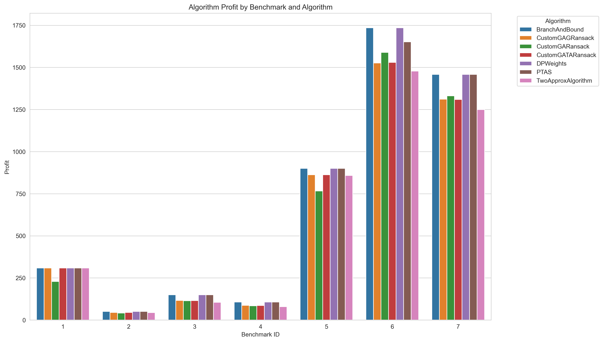

# IO-Lab3-GeneticAlgorithms

Genetic algorithms for solving Knapsack 0-1 problem

# **Отчет: Knapsack 0-1 problem**

Мы реализовали генетический алгоритм для решения knapsack 0-1 problem. Основной алгоритм инициализируется на полностью случайных весах. Два дополнительных: Greed и TwoApprox использует при инициализации соответствующие алгоритмы.

Алгоритм на каждом бенчмарке запускался 1000 раз, чтобы оценить среднее время и среднее качество. Видно, что все алгоритмы работают в общем хуже, чем остальные, что объясняется выбором гиперпараметров таким образом, чтобы увеличить скорость работы за счёт малого числа итерации и размера популяции. Ниже представлена таблица результатов, сгруппирована по бенчмаркам и алгоритмам.
Стартовые параметры:
```
custom_ga_params = {
        'population_size': 3,
        'generations': 2,
        'crossover_rate': 0.85,
        'mutation_rate': 0.1,
        'tournament_size': 3,
        'elitism': True
    }
```

# **Таблица:**

| bench id | algorithm          | time                  | number of inter solutions | alg weights                     | alg total weight | alg profit |
|----------|--------------------|-----------------------|---------------------------|----------------------------------|------------------|------------|
| 1        | BranchAndBound     | 2.7287e-05            | 12                        | [1, 1, 1, 1, 0, 1, 0, 0, 0, 0]   | 165              | 309.0      |
| 1        | CustomGAGRansack   | 7.517899999999998e-05 | 6                         | [1, 1, 1, 1, 0, 1, 0, 0, 0, 0]   | 165              | 309.0      |
| 1        | CustomGARansack    | 0.00022030300000000004 | 6                         | [0, 1, 0, 1, 0, 0, 0, 0, 1, 0]   | 164              | 228.504    |
| 1        | CustomGATARansack  | 8.494199999999996e-05 | 6                         | [1, 1, 1, 1, 0, 1, 0, 0, 0, 0]   | 165              | 309.0      |
| 1        | DPWeights          | 0.0010803129999999994 | 1123                      | [1, 1, 1, 1, 0, 1, 0, 0, 0, 0]   | 165              | 309.0      |
| 1        | PTAS               | 0.00011507399999999996 | 56                        | [1, 1, 1, 1, 0, 1, 0, 0, 0, 0]   | 165              | 309.0      |
| 1        | TwoApproxAlgorithm | 1.3189999999999997e-05 | 6                         | [1, 1, 1, 1, 0, 1, 0, 0, 0, 0]   | 165              | 309.0      |
| 2        | BranchAndBound     | 7.409e-06             | 12                        | [0, 1, 1, 1, 0]                  | 26               | 51.0       |
| 2        | CustomGAGRansack   | 5.9748e-05            | 6                         | [0, 1, 0, 1, 1]                  | 24               | 44.686     |
| 2        | CustomGARansack    | 6.6392e-05            | 6                         | [0, 0, 1, 0, 1]                  | 20               | 41.244     |
| 2        | CustomGATARansack  | 6.141399999999998e-05 | 6                         | [0, 1, 0, 1, 1]                  | 24               | 44.693     |
| 2        | DPWeights          | 9.641400000000002e-05 | 88                        | [0, 1, 1, 1, 0]                  | 26               | 51.0       |
| 2        | PTAS               | 2.9803999999999998e-05 | 16                        | [0, 1, 1, 1, 0]                  | 26               | 51.0       |
| 2        | TwoApproxAlgorithm | 7.5069999999999994e-06 | 4                         | [0, 1, 0, 1, 1]                  | 24               | 44.0       |
| 3        | BranchAndBound     | 1.5308000000000003e-05 | 20                        | [1, 1, 0, 0, 1, 0]               | 190              | 150.0      |
| 3        | CustomGAGRansack   | 7.8453e-05            | 6                         | [1, 1, 0, 0, 0, 1]               | 132              | 115.88     |
| 3        | CustomGARansack    | 8.400399999999999e-05 | 6                         | [0, 1, 1, 0, 0, 1]               | 156              | 114.274    |
| 3        | CustomGATARansack  | 8.790699999999997e-05 | 6                         | [1, 1, 0, 0, 0, 1]               | 132              | 114.925    |
| 3        | DPWeights          | 0.0008164130000000008 | 795                       | [1, 1, 0, 0, 1, 0]               | 190              | 150.0      |
| 3        | PTAS               | 4.055700000000001e-05 | 22                        | [1, 1, 0, 0, 1, 0]               | 190              | 150.0      |
| 3        | TwoApproxAlgorithm | 7.327e-06             | 4                         | [1, 1, 0, 0, 0, 1]               | 132              | 105.0      |
| 4        | BranchAndBound     | 1.7603e-05            | 20                        | [1, 0, 0, 1, 0, 0, 0]            | 50               | 107.0      |
| 4        | CustomGAGRansack   | 6.427700000000001e-05 | 6                         | [0, 1, 1, 1, 0, 0, 0]            | 49               | 86.692     |
| 4        | CustomGARansack    | 7.2016e-05            | 6                         | [0, 1, 0, 1, 1, 1, 0]            | 36               | 84.332     |
| 4        | CustomGATARansack  | 6.694900000000001e-05 | 6                         | [1, 1, 0, 0, 0, 0, 0]            | 41               | 86.324     |
| 4        | DPWeights          | 0.0002407330000000001 | 264                       | [1, 0, 0, 1, 0, 0, 0]            | 50               | 107.0      |
| 4        | PTAS               | 5.5700999999999994e-05 | 29                        | [1, 0, 0, 1, 0, 0, 0]            | 50               | 107.0      |
| 4        | TwoApproxAlgorithm | 5.5399999999999995e-06 | 6                         | [0, 1, 0, 1, 1, 1, 1]            | 42               | 79.0       |
| 5        | BranchAndBound     | 3.3371e-05            | 38                        | [1, 0, 1, 1, 1, 0, 1, 1]         | 104              | 900.0      |
| 5        | CustomGAGRansack   | 6.614500000000001e-05 | 6                         | [1, 0, 1, 1, 1, 1, 0, 0]         | 103              | 862.044    |
| 5        | CustomGARansack    | 6.921200000000001e-05 | 6                         | [1, 1, 0, 0, 0, 0, 0, 1]         | 62               | 766.551    |
| 5        | CustomGATARansack  | 0.00010068299999999993 | 6                         | [1, 1, 0, 1, 1, 1, 1, 1]         | 97               | 862.14     |
| 5        | DPWeights          | 0.0006481060000000003 | 698                       | [1, 0, 1, 1, 1, 0, 1, 1]         | 104              | 900.0      |
| 5        | PTAS               | 0.000102902           | 37                        | [1, 0, 1, 1, 1, 0, 1, 1]         | 104              | 900.0      |
| 5        | TwoApproxAlgorithm | 8.805e-06             | 8                         | [1, 1, 0, 1, 1, 1, 1, 1]         | 97               | 858.0      |
| 6        | BranchAndBound     | 5.430700000000001e-05 | 84                        | [0, 1, 0, 1, 0, 0, 1]            | 169              | 1735.0     |
| 6        | CustomGAGRansack   | 6.2643e-05            | 6                         | [1, 1, 1, 0, 0, 0, 0]            | 140              | 1526.618   |
| 6        | CustomGARansack    | 8.1346e-05            | 6                         | [1, 1, 0, 0, 0, 0, 1]            | 151              | 1589.23    |
| 6        | CustomGATARansack  | 5.942399999999997e-05 | 6                         | [1, 1, 0, 0, 1, 0, 0]            | 146              | 1529.51    |
| 6        | DPWeights          | 0.0008013710000000006 | 826                       | [0, 1, 0, 1, 0, 0, 1]            | 169              | 1735.0     |
| 6        | PTAS               | 5.571099999999999e-05 | 29                        | [1, 0, 0, 1, 0, 0, 1]            | 160              | 1652.0     |
| 6        | TwoApproxAlgorithm | 7.167e-06             | 4                         | [1, 1, 1, 0, 0, 0, 0]            | 140              | 1478.0     |
| 7        | BranchAndBound     | 0.00010336900000000005 | 138                       | [1, 0, 1, 0, 1, 0, 1, 1, 1, 0, 0, 0, 0, 1, 1] | 749 | 1458.0     |
| 7        | CustomGAGRansack   | 9.399399999999994e-05 | 6                         | [1, 0, 1, 0, 1, 1, 1, 1, 0, 1, 1, 0, 0, 0, 0] | 716 | 1311.149   |
| 7        | CustomGARansack    | 0.00010867899999999998 | 6                         | [1, 1, 0, 1, 0, 1, 1, 0, 1, 0, 0, 1, 0, 0, 1] | 731 | 1331.099   |
| 7        | CustomGATARansack  | 9.0851e-05            | 6                         | [1, 1, 1, 1, 1, 1, 1, 1, 0, 0, 0, 0, 0, 0, 0] | 653 | 1309.186   |
| 7        | DPWeights          | 0.00929219699999999   | 9832                      | [1, 0, 1, 0, 1, 0, 1, 1, 1, 0, 0, 0, 0, 1, 1] | 749 | 1458.0     |
| 7        | PTAS               | 0.0003349240000000002 | 121                       | [1, 0, 1, 0, 1, 0, 1, 1, 1, 0, 0, 0, 0, 1, 1] | 749 | 1458.0     |
| 7        | TwoApproxAlgorithm | 1.9214000000000003e-05 | 9                         | [1, 1, 1, 1, 1, 1, 1, 1, 0, 0, 0, 0, 0, 0, 0] | 653 | 1249.0     |

# **Время работы:**


Видно, что чистый GA может отставать по времени работы из-за подбора случайных начальных векторов в пределах допустимого веса. Но в целом, алгоритмы работают в пределах времени работы негенетических алгоритмом. (На данном графике по времени нет DPWeights, так как он сильно дольше работает, чем остальные и искажает восприятие)

# **Итоговые результаты:**



Генетические алгоритмы при заданных гиперпараметрах дают достаточно хорошую аппроксимацию к идеальному результату. Здесь нужно исходить из того, что ценнее: время работы алгоритма или точность результата. При этом видно, что GATA (GA + TwoApprox) и CAG (GA + Greed) в ряде случаев показывают результат лучше за счёт изначально хорошей аппроксимации, а в ряде других стагнируют около исходной точки отправления

# **Отчет: Genetic Algorithms for Traveling Salesman Problem**

Мы реализовали генетический алгоритм для решения задачи коммивояжера (TSP). Алгоритм был протестирован на нескольких стандартных бенчмарках из TSPLIB. Для каждого бенчмарка было выполнено **20 независимых запусков** алгоритма с одинаковыми параметрами. Среднее время выполнения всех тестов составило **~30 минут**.

Гиперпараметры:
```
population_size: int = 100,
generations: int = 1000,
crossover_rate: float = 0.9,
mutation_rate: float = 0.2,
tournament_size: int = 5,
elitism: bool = True,
time_limit_sec: int = 300

```
# **Таблица:**

## Результаты генетического алгоритма для задачи коммивояжера

| benchmark  | best_distance | avg_time_sec | tour |
|------------|---------------|--------------|------|
| a280.tsp   | 11666         | 33.768       | [138, 147, 162, 163, 165, 166, 104, 90, 92, 94, 74, 76, 45, 39, 36, 53, 52, 55, 62, 43, 50, 51, 48, 68, 71, 91, 99, 182, 264, 203, 196, 194, 188, 185, 183, 67, 89, 64, 70, 85, 110, 81, 75, 57, 54, 46, 40, 37, 35, 33, 176, 29, 26, 9, 12, 11, 132, 15, 128, 113, 61, 190, 192, 148, 250, 239, 242, 275, 137, 175, 97, 93, 79, 133, 134, 23, 21, 18, 267, 16, 114, 109, 87, 118, 122, 149, 177, 116, 47, 34, 125, 127, 27, 189, 191, 193, 218, 224, 227, 226, 230, 210, 139, 129, 152, 135, 269, 208, 252, 207, 211, 205, 263, 268, 266, 251, 204, 195, 197, 187, 186, 173, 171, 164, 199, 201, 144, 155, 59, 38, 56, 44, 154, 159, 158, 32, 31, 28, 124, 25, 121, 42, 72, 95, 96, 98, 100, 168, 170, 184, 130, 24, 131, 19, 174, 161, 160, 179, 206, 209, 229, 262, 22, 17, 136, 265, 140, 141, 202, 217, 222, 220, 231, 245, 213, 216, 215, 274, 255, 257, 83, 69, 58, 63, 115, 120, 153, 30, 119, 126, 41, 73, 86, 2, 0, 7, 253, 254, 1, 270, 6, 8, 273, 272, 151, 156, 181, 200, 145, 261, 10, 14, 248, 236, 238, 234, 225, 233, 237, 240, 4, 279, 5, 247, 3, 277, 13, 276, 256, 260, 271, 105, 106, 157, 117, 60, 146, 212, 214, 219, 221, 223, 232, 228, 259, 249, 244, 243, 246, 235, 241, 278, 258, 150, 108, 78, 80, 88, 123, 20, 178, 180, 172, 167, 169, 107, 77, 82, 112, 111, 65, 66, 49, 84, 102, 101, 103, 198, 143, 142] |
| att48.tsp  | 12762       | 5.699       | [43, 30, 37, 7, 0, 8, 39, 14, 45, 11, 19, 46, 20, 31, 23, 44, 34, 3, 25, 9, 41, 1, 28, 13, 33, 40, 15, 21, 2, 22, 24, 12, 38, 47, 4, 10, 32, 35, 27, 6, 17, 29, 5, 36, 18, 16, 26, 42] |
| bays29.tsp | 2046          | 	2.977        | [19, 9, 12, 23, 15, 18, 3, 14, 17, 16, 13, 21, 10, 24, 6, 22, 26, 7, 0, 27, 5, 11, 8, 4, 25, 28, 2, 1, 20] |
| ch150.tsp  | 18910       | 12.02     | [92, 70, 43, 63, 105, 127, 67, 118, 90, 12, 73, 30, 122, 115, 11, 23, 19, 24, 66, 76, 121, 104, 45, 89, 69, 107, 134, 28, 1, 108, 42, 31, 22, 38, 129, 65, 139, 59, 128, 62, 88, 29, 6, 86, 75, 2, 61, 112, 9, 87, 21, 103, 3, 124, 148, 97, 94, 72, 33, 0, 93, 58, 79, 144, 48, 85, 57, 136, 49, 131, 7, 83, 95, 51, 143, 40, 39, 138, 56, 26, 116, 100, 130, 133, 99, 142, 4, 141, 17, 18, 52, 147, 16, 53, 91, 137, 60, 68, 117, 113, 98, 119, 27, 101, 8, 41, 132, 77, 135, 111, 14, 37, 126, 10, 35, 146, 71, 13, 78, 15, 110, 120, 34, 125, 82, 54, 64, 80, 5, 36, 145, 55, 140, 50, 109, 46, 32, 123, 106, 81, 102, 47, 149, 44, 114, 20, 25, 74, 84, 96] |
| fl417.tsp  | 146922     | 39.994       | [21, 76, 206, 240, 232, 233, 391, 404, 360, 361, 389, 401, 380, 407, 365, 47, 54, 168, 166, 193, 309, 310, 336, 338, 323, 158, 186, 33, 73, 70, 46, 173, 188, 317, 156, 172, 318, 199, 192, 326, 169, 200, 37, 69, 61, 81, 64, 58, 43, 41, 36, 143, 145, 110, 307, 129, 304, 341, 301, 299, 372, 281, 260, 245, 219, 215, 216, 213, 212, 204, 225, 230, 227, 68, 123, 9, 99, 80, 85, 159, 179, 167, 157, 77, 83, 55, 321, 116, 345, 328, 306, 115, 144, 125, 387, 402, 403, 381, 209, 96, 89, 111, 120, 12, 52, 66, 280, 287, 78, 363, 367, 364, 202, 358, 400, 357, 399, 382, 405, 17, 196, 194, 161, 163, 190, 174, 393, 370, 395, 134, 121, 139, 29, 394, 368, 416, 373, 236, 388, 392, 362, 104, 97, 272, 295, 257, 259, 275, 263, 270, 261, 241, 221, 411, 409, 369, 293, 256, 265, 266, 101, 63, 91, 384, 258, 254, 79, 65, 28, 347, 332, 132, 140, 118, 7, 311, 50, 94, 242, 231, 355, 165, 160, 288, 291, 264, 282, 49, 45, 53, 38, 34, 19, 352, 353, 42, 376, 396, 294, 262, 279, 378, 414, 103, 62, 100, 246, 217, 243, 203, 87, 95, 93, 247, 207, 75, 354, 164, 60, 74, 150, 1, 349, 6, 25, 23, 148, 106, 198, 176, 183, 187, 177, 0, 114, 131, 136, 324, 312, 189, 153, 337, 315, 305, 152, 142, 24, 2, 348, 308, 178, 175, 197, 350, 67, 374, 375, 413, 48, 162, 195, 15, 30, 5, 16, 8, 26, 44, 283, 296, 250, 410, 277, 278, 267, 284, 251, 11, 22, 128, 105, 133, 300, 320, 331, 302, 127, 84, 253, 252, 408, 239, 205, 229, 244, 234, 273, 286, 269, 292, 334, 154, 351, 333, 137, 290, 249, 398, 385, 285, 412, 371, 415, 377, 271, 268, 51, 181, 184, 313, 343, 112, 57, 92, 86, 82, 72, 226, 208, 214, 223, 56, 170, 180, 3, 18, 108, 327, 185, 356, 191, 35, 40, 210, 211, 237, 218, 117, 319, 297, 151, 344, 146, 135, 303, 13, 325, 171, 10, 359, 379, 228, 201, 102, 71, 109, 298, 383, 274, 386, 276, 255, 289, 397, 98, 90, 149, 126, 20, 119, 124, 130, 39, 32, 59, 220, 235, 366, 406, 390, 248, 224, 238, 222, 88, 141, 329, 147, 122, 182, 314, 155, 316, 14, 330, 346, 322, 339, 113, 138, 27, 107, 342, 340, 335, 31, 4] |
| gr17.tsp   | 2085          | 2.089      | [3, 0, 15, 11, 8, 4, 1, 9, 10, 2, 14, 13, 16, 5, 7, 6, 12] |

Полученные данные демонстрируют стабильную работу алгоритма на задачах различной сложности.

